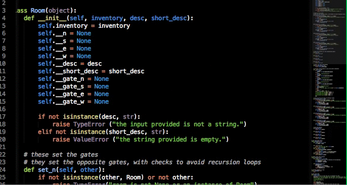

[](https://git.io/typing-svg)

<p align="left">  </p>
Welcome to my page!

Hello Alvin! It's great to meet you. As a fullstack developer, you have a unique opportunity to work with both the front-end and back-end of web applications, which requires a diverse set of technical skills. Your passion for creative problem solving and love for technology will serve you well in this field, as you'll need to constantly adapt to new technologies and find innovative solutions to complex problems.

In addition to your technical skills, being a fullstack developer also requires strong communication and collaboration skills, as you'll often work with designers, project managers, and other developers to bring projects to life. It's important to be able to clearly communicate your ideas and work well with others to ensure that projects are completed on time and to the highest standard.

I'm excited to see where your love for technology takes you in your career as a fullstack developer!

Things I code with


<h1>Copy Profile</h1>

```md
https://github.com/alvin-kiveu/
```


